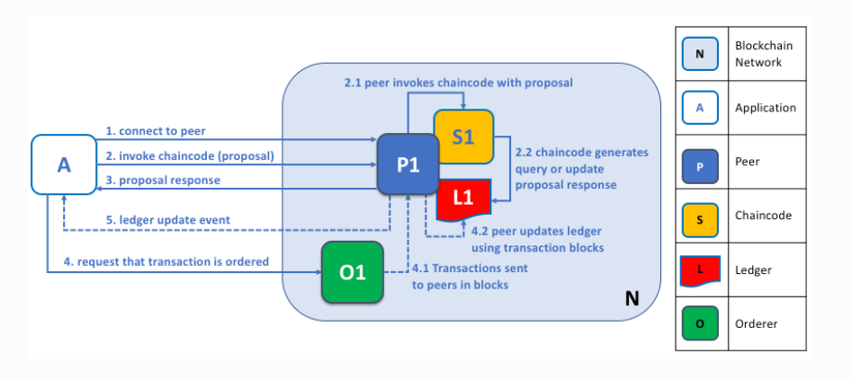

### different policies in configtx.yaml files

1. Readers: Readers section defines who have access to the channel's configration.
this includes entities that are allowed to query the channel configration , such as 
peer and clients

Example:

Readers:
   Type: implicitMeta
   Rule: "Any Readers"

This policy allows any entity (identified by their MSP identity) to read the channel configuration.

2. Writers: The Writers section defines who has write access to the channel's configration. this includes entites that are allowed to submit configration update to the channel.

Example:

Writers:
  Type: ImplicitMeta
  Rule: "ANY Writers"

this policy allow any entity (identified by thier MSP identity) to write to the channel configration.

such as 
a. order org admins

Writers:
  Type: Signature
  Rule: "OR('OrdererMSP.admin')"

b. channel application admins( orgs admin )   

admins of channel's application orgs may have access to propose and approve the channel configration updated like Bank, Insurance Company, healthcare company etc. 

c. channel Operator Users: specific users designated as channel operator can have config update access.
Ex

Writers:
   Types: Signature
   Rule: "OR('Org1MSP.operator', 'Org2MSP.operator', '....')"

d. Application Clients: clients that interacts with network's applications( like chaincode, client application, Transaction Processing Logic, UI or other external s/s integrated with network's app) may have write access on behalf on their org

EX
Writers:
   Types: Signature
   Rule: "OR('Org1MSP.client', 'Org2MSP.client', '.....')"

3. Admins: this section defines who have admin access can modifed the channel config or perform administrative task

Ex:

Admins:
   Type: ImplicitMeta
   Rules: "Majority Admins"

4. AdminPolicy: this section defines identities that can authorize the configration updates. i.e who can approve the channel configration transactions

Ex: 

AdminPolicy:
   Type: Signature
   Rule: "OR('Org1MSP.admin', 'Org2MSP.admin')"  

5. LifecycleEndorsement: used duing lifecycle  mgmt of chaincode. it defines cretria for endorsing the chaincode package.
LifecycleEndorsement:
  Type: ImplicitMeta
  Rule: "MAJORITY Endorsement"

6. Endorsment: defines the cretria for endorsing individual transactions that invoke chaincode logic to make transaction valid

Endorsement:
  Type: Signature
  Rule: "OR('Org1MSP.peer','Org2MSP.peer')"

Type Field in each Policy Section: it determines how the policy is evaluated and which rules are applied to determine weather the policy is satisfied.

1. Signature: this type specifed one or more signature from specified identites
like admin, peers, clients
Example: Type: Signature
2. ImplicitMeta: number of identites that satisfy the specified rule. like ANY, ALL, MAJORITY
Example: Type: ImplicitMeta

3. Channel/Application ACL: this defines Aceess control Logic for specific action or operation within the channel or application, like which identify have read, write or invoke acess.
Example: Type: ACL

4. Lifecycle: for lifecycle management operations( like chaincode installation, approval) .defines rules for lifecycle.
Example: Type: Lifecycle

5. Hash: this type ensure hash of current configration matches a predefined hash valule.

Example: Type: Hash

### CSR(Certificate Signing Request)

csr is an message sent from applicat to CA for a digital identity certificate. 
CSR contains information about the entity requesting the certificate and is used by the CA to generate certificate that asserts the identity of the applicant.

1. content of CRT: it contain public key, DN(distinguished name): info about the entity like common name , orgnization, country

2. usages in HLF
a. Identity Enrollment : CA uses CSR information to issue certificate
b. Reenrollment
c. tls certificate issuence 

Example CSR Attributes:

Common Name(CN) : the name of the identity (like admin, peer0.org1.exampel.com, order.example.com)

Orgnization(O): the org name to which the identiy belongs
Orgnization Unit(OU): the unit within the orgnization 
County(C): like US
State(S): like North California
Locality(L): Raleigh

Orgnization Unit(OU): 
OU for peer Nodes
OU: peers
OU for client apps
OU for different department 
OU: finance
OU for different project team
OU: project_alpha
OU for different geo location
OU: london

OU for different business unit 
OU: sales

csr file example

csr:
  cn: peer0.org1.example.com
  names:
    - C: US
      ST: California
      L: San Francisco
      O: Org1
      OU: peers
      OU: IT
  hosts:
    - peer0.org1.example.com
    - localhost

## what is CORE_OPERATIONS_LISTENADDRESS

this is called operational end point. this is used for monitoring and managing (like metrics, heatlh checkes, and logging endponts)the peer or orderer. using port we expose the peer to network
Ex: 
export CORE_OPERATIONS_LISTENADDRESS=127.0.0.1:9443

tls configration in core.yaml

operations:
  listenAddress: 127.0.0.1:9443
  tls:
    enabled: true
    cert:
      file: /path/to/tls-cert.pem
    key:
      file: /path/to/tls-key.pem
    clientAuthRequired: false
    clientRootCAs:
      files:

Metrics and Health Checks

* Metrics: Accessible at http://127.0.0.1:9443/metrics (or https if TLS is enabled).
* Health Check: Accessible at http://127.0.0.1:9443/healthz (or https if TLS is enabled).

Access metrics:
a. curl http://127.0.0.1:9443/metrics

b. if tls enable
export CORE_OPERATIONS_TLS_ENABLED=true
export CORE_OPERATIONS_TLS_CERT_FILE=/path/to/tls-cert.pem
export CORE_OPERATIONS_TLS_KEY_FILE=/path/to/tls-key.pem

curl --cacert /path/to/ca-cert.pem https://127.0.0.1:9443/metrics

Access health:
curl http://127.0.0.1:9443/healthz
{"status":"OK","time":"2024-05-18T06:29:35.78243052Z"}

## Node OU
allow role-based identity managment within the network. Node OU help in categorizing and validating the roles of different nodes(client, peer, orderer, admin)

an certificate container Node OU with value peer ,would be idetified as peer .
It distinguish and enforce role and permissions based of the type of node. It also allow to enfore policy based on the roles.

* Hyperledger Fabric will correctly identify the node as a peer based on the PeerOUIdentifie

## practical Implications of NODE OU

Access Control: Node OUs help in defininig access control policies that are specific to clients, peers, orderers, admins

Role Management: simplifies the managment of different roles within network by validating the certificates to determine the node type

Policy Enforcement: ensure only node with correct OU identifiers can perform certain actions , thereby enhainicng security and role segregation.

## Updating an endorsement policy

same chaincode can be used to update the endorsment policy without repackgeing and reinstalling the chaincode. all channel member can endorse a transaction (approvemyorg transaction with new endorsment policy) by increasisng the sequence number by one and no need to update the chaincode version. after that one of the org can commit the same chaicnde with new endorsment policy

## MSP

msp turn certificate provided by PKI to idnetity, MSP also have CA certiface (along with issued identtity into users directory of msp) who is 
allowed to issue the certificates. beyond that MSP turn identity into role,there are different type of role like admin, peer, orderer , client,member . msp identify  actor have which previleged on peer or channel.   

## MSP domains

MSPs occur in two domains in the blockchain network

1. locally on actor's node (local MSP)
2. In channel configration (channel MSP)

## local MSPs
local MSPs are defined for clients and for the nodes(peer and orderer)
every node must have local MSP defieds, as it defines who has administratvive or participatry rights.  like  peers admin will not necessary be channel admins, and vice versa.

## CHannel MSPs

channel MSPs defines administractive and participatory rights at the channel level.

Channel MSPs identify who has authorities at a channel level. chnnel level MSPs defined the relatioship bitwwen channel level member identiity and enforsment of level level polocies.

NOTE: Every organization participating in a channel must have an MSP defined for it.
NOTE: The system channel MSP includes the MSPs of all the organizations that participate in an ordering service. 
NOTE: Local MSPs are only defined on the file system of the node or user 
NOTE: MSP allows an idnetity to be linked to an organization, 
NOTE: a channel MSP also have additional folder of Revoked Certificates.

## NodeOUs
it provide a way to clasifiy identities in a digital certificate hierarchy.
 For instance, an organization having specific NodeOUs enabled could require that a ‘peer’ sign for it to be a valid endorsement.

 ## different role under any organization

 <OrgMSPName><ROLE>
 Org1MSP.Admin
 Org1MSP.Peer
 Org1MSP.Client : (application that interact with network on user behalf, that is how end user access the application)
 Org1MSP.Member:  this refert to the any member of the orgs including peers, admins, clients , more general policy can be defined as MSP.Member

## different type of peers

endorsment peer:
commititing peer:
leader peer: get the block from orderer and shared it with other peers of same orgnixation, we can defined it as static or dynamic. can be set zero or more than one.
anchor peer: for communication accross the orgs, you can define zero ore more than one anchor peer.

## Channel capabilities

capablities which are defined in the configration of each channel, ensure determinisum by defining a level at which behaviours produce same result.
NOTE: Capabilities enable nodes running at different version levels to behave in a compatible and consistent way given the channel configuration at a specific block height 

## communication protocol

1. gRPC: for peer, orderer, client interaction
2. gossip protocol: for peer discovery, data dissemination, and maintaining ledger consistency.

3. HTTP/2 and TLS: For secure and efficient data transport.

4. REST APIs:  For client interaction and administrative operations.

